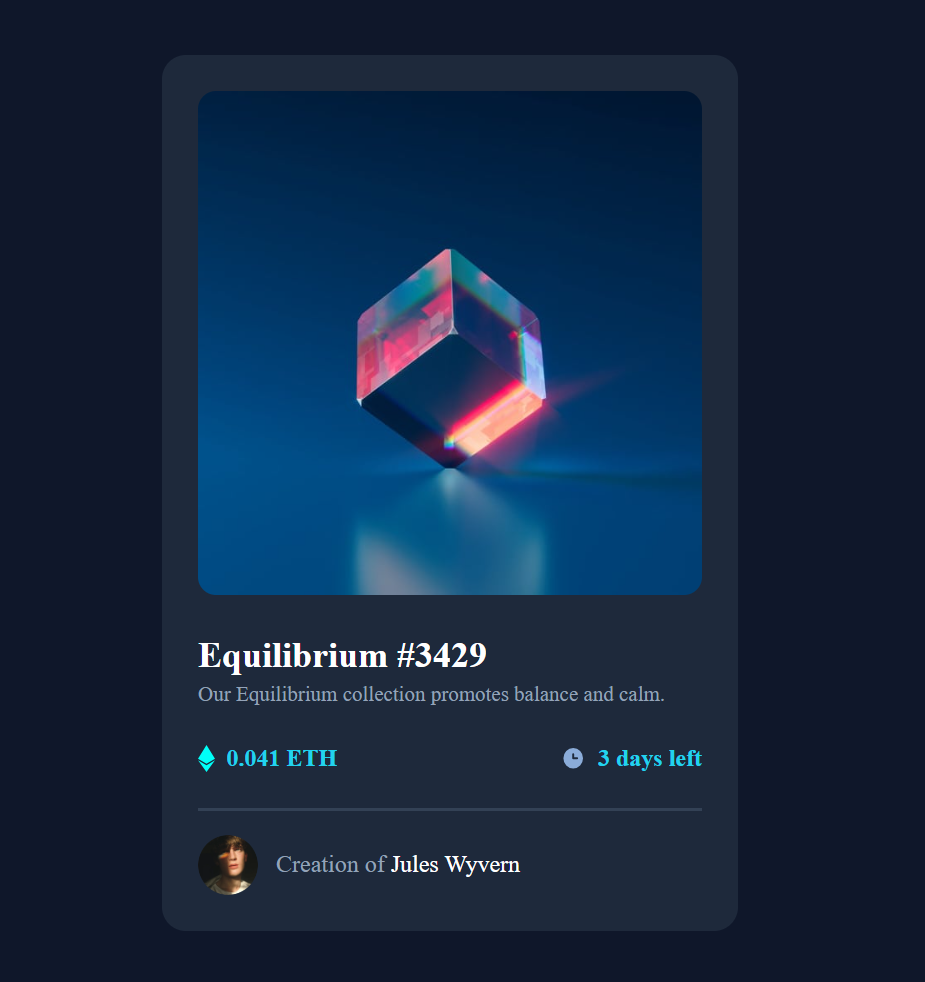
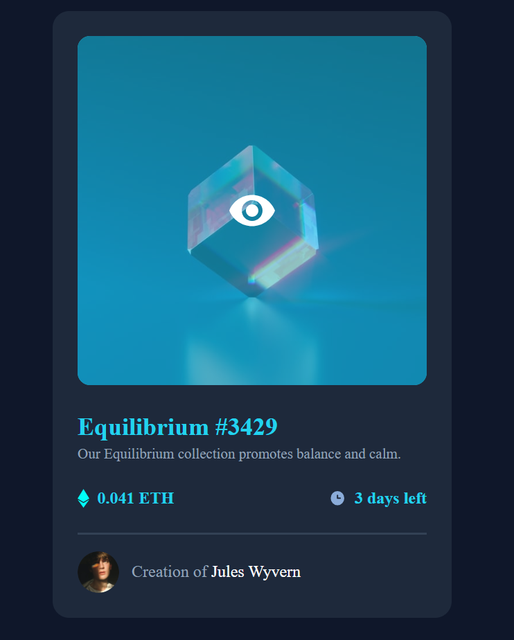

# Frontend Mentor - NFT preview card component solution

This is a solution to the [NFT preview card component challenge on Frontend Mentor](https://www.frontendmentor.io/challenges/nft-preview-card-component-SbdUL_w0U). Frontend Mentor challenges help you improve your coding skills by building realistic projects.

## Table of contents

- [Overview](#overview)
  - [The challenge](#the-challenge)
  - [Screenshot](#screenshot)
  - [Links](#links)
- [My process](#my-process)
  - [Built with](#built-with)
  - [What I learned](#what-i-learned)
  - [Continued development](#continued-development)
  - [Useful resources](#useful-resources)
- [Author](#author)
- [Acknowledgments](#acknowledgments)

## Overview

### The challenge

Users should be able to:

- View the optimal layout depending on their device's screen size
- See hover states for interactive elements

### Screenshot

### Links

- Solution URL: [Add solution URL here](https://your-solution-url.com)
- Live Site URL: [Add live site URL here](https://your-live-site-url.com)

## My process

### Built with

- Semantic HTML5 markup
- CSS custom properties
- Flexbox
- CSS Grid
- Mobile-first workflow
- [React](https://reactjs.org/) - JS library
- [Next.js](https://nextjs.org/) - React framework
- [Styled Components](https://styled-components.com/) - For styles

### What I learned

#### 1.What I learned

I learned how to create an overlay effect using absolute positioning and transitions. The hover effect on the NFT image was particularly interesting to implement:

To see how you can add code snippets, see below:
.card\_\_view {
position: absolute;
display: flex;
justify-content: center;
align-items: center;
inset: 0;
border-radius: 0.75rem;
transition: background-color 0.3s ease;
}

#### 2.Javascript Event Listeners

I practiced implementing multiple hover effects using JavaScript event listeners. This allowed me to create synchronized effects across different elements:
cardHeader.addEventListener("mouseenter", function () {
cardImage.style.backgroundColor = "#22d3ee";
cardImage.style.borderRadius = "0.75rem";
imageMain.style.opacity = "0.5";
viewIcon.style.opacity = "1";
});

#### 3.BEM Naming Convention

I used the BEM (Block Element Modifier) methodology for CSS class naming, which helped keep my styles organized and maintainable:

  

    0.041 ETH
  

#### 4.Flexbox Layout

I utilized Flexbox extensively for creating the card layout, centering content, and managing spacing between elements. This made the component responsive and easy to align.

### Useful resources

## Author

- Website - Kha Tu Pham
- Frontend Mentor - [@yourusername](https://www.frontendmentor.io/profile/khatupham1996)
